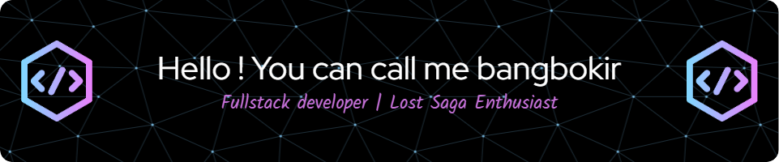

###

  
  

###

  

###

###

 

<h2 align="center">🛠 Featured Programming Languages ​​and Tools</h2>

###

 

  
  
  
  
  
  
  
  
  
  
  
  
  

###

    
  

###

 

<picture>
  <source media="(prefers-color-scheme: dark)" srcset="https://raw.githubusercontent.com/bangbokirs/bangbokirs/output/pacman-contribution-graph-dark.svg">
  <source media="(prefers-color-scheme: light)" srcset="https://raw.githubusercontent.com/bangbokirs/bangbokirs/output/pacman-contribution-graph.svg">
  
</picture>

###
